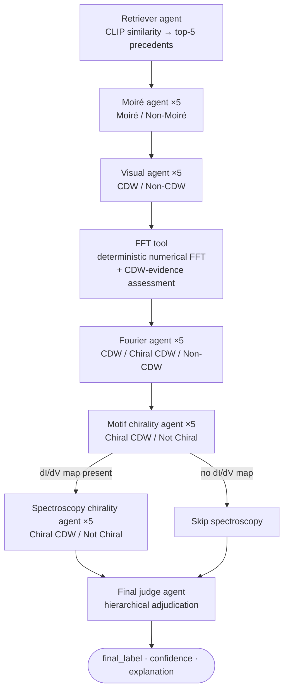

# ChiralNet

**Agentic vision-language reasoning for identifying charge order in quantum materials.**

ChiralNet is an agentic vision-language system that classifies scanning tunneling
microscopy / spectroscopy (STM/STS) images as **CDW**, **Chiral CDW**, or **Non-CDW**
— *without any task-specific training*. Instead of a single end-to-end classifier, it
routes each measurement through a fixed pipeline of specialist large-language-model
(LLM) agents that mirror how an expert microscopist reasons: moiré screening, real-space
morphology, reciprocal-space (Fourier) inference, motif handedness, and spectroscopic
chirality. A final *judge* agent adjudicates their structured evidence hierarchically and
returns an auditable label, a confidence score, and a written rationale.

The pipeline is backed by a **deterministic numerical FFT engine** (windowed 2‑D FFT,
conservative reciprocal-space peak detection, and a symmetric-pair CDW-evidence
assessment) and a **CLIP-based retriever** that surfaces the most similar labeled
precedents from a curated corpus of 209 published STM/STS measurements.

> This repository accompanies the manuscript *"Agentic vision-language reasoning
> identifies chiral charge order in quantum materials"* (Hridoy, Chowdhury & Hossain).
> See [Citation](#citation).

---

## Table of contents

- [Why ChiralNet](#why-chiralnet)
- [How it works](#how-it-works)
  - [The agent pipeline](#the-agent-pipeline)
  - [The deterministic FFT engine](#the-deterministic-fft-engine)
- [Repository structure](#repository-structure)
- [Installation](#installation)
- [Usage](#usage)
  - [1. The Streamlit app (primary interface)](#1-the-streamlit-app-primary-interface)
  - [2. The FFT analysis tool (standalone CLI)](#2-the-fft-analysis-tool-standalone-cli)
  - [3. Programmatic use](#3-programmatic-use)
- [Inputs and calibration](#inputs-and-calibration)
- [The retrieval corpus](#the-retrieval-corpus)
- [Output labels](#output-labels)
- [Configuration reference](#configuration-reference)
- [Reported benchmark results](#reported-benchmark-results)
- [Limitations](#limitations)
- [Citation](#citation)
- [Authors & contact](#authors--contact)
- [License](#license)

---

## Why ChiralNet

Charge density waves (CDWs) are ordered electronic states; their *chiral* variants
additionally break mirror symmetry and have been linked to unconventional
superconductivity and anomalous transport. Deciding whether an STM/STS measurement shows
a CDW — and whether that CDW is chiral — is normally an expert, manual judgment that is
slow, subjective, and hard to standardize across labs. Supervised classifiers are not a
viable substitute, because chiral CDWs are so rare (only a handful of published examples)
that no meaningfully sized training set can exist.

ChiralNet takes a different route. It reasons about *one measurement at a time* the way an
expert would — weighing several physically distinct forms of evidence, consulting
precedent sparingly, and stating its confidence — using zero-shot multimodal LLMs
orchestrated into a fixed, auditable workflow.

**Design principles**

- **Deterministic orchestration.** Agents always run in the same order (moiré screening →
  morphology → chirality), so every classification follows the same auditable path.
- **Structured evidence.** Agents exchange labeled fields with confidences (JSON), not
  free text, so the judge applies explicit rules to explicit quantities.
- **Narrow specialists.** Each agent answers exactly one question an expert would
  recognize as a distinct step, which makes individual failures diagnosable.
- **Ensemble voting.** Each specialist runs 5 times and its answers are combined by
  majority vote, converting run-to-run LLM variability into a stable decision.
- **Conditional spectroscopy.** When a dI/dV map is supplied, spectroscopic chirality
  evidence dominates the chirality decision; when it is absent, ChiralNet still runs on
  the topograph alone (with correspondingly lower-confidence chirality calls).

---

## How it works

### The agent pipeline

The workflow is a [LangGraph](https://github.com/langchain-ai/langgraph) state graph
compiled in `core_pipeline.py`. State flows through the nodes in a fixed order; the only
branch is whether the spectroscopy agent runs (it runs only when a dI/dV map is provided).



| Agent | Node | Input | Allowed labels | Role |
| --- | --- | --- | --- | --- |
| **Retriever** | `retriever_agent` | Topograph (+ optional dI/dV) + metadata | — | Embeds the query with CLIP, returns the top-5 most similar labeled precedents from the corpus. Used **only** to modulate the confidence of the final label, never as a classifier. |
| **Moiré** | `ensemble_moiré` | Topograph | `Moiré`, `Non-Moiré` | Screens for long-wavelength moiré interference and diverts such cases away from the charge-order path. |
| **Visual** | `ensemble_visual` | Topograph | `CDW`, `Non-CDW` | Classifies real-space morphology; treats repeated non-atomic modulation as positive CDW evidence. |
| **FFT tool** | `fft_tool` | Topograph bytes (+ FOV) | — (numeric) | Deterministic, non-LLM node. Computes the windowed 2‑D FFT, detects reciprocal-space peaks, and produces a `cdw_evidence_level` of `strong` / `weak` / `insufficient`. |
| **Fourier** | `ensemble_fourier` | Topograph + numerical FFT results + FFT figure | `CDW`, `Chiral CDW`, `Non-CDW` | Grounds a reciprocal-space judgment in the numerical FFT output rather than in a purely visual guess. |
| **Motif chirality** | `ensemble_motif` | Topograph | `Chiral CDW`, `Not Chiral` | Tests whether the topograph contains repeated *handed* motifs. |
| **Spectroscopy chirality** | `ensemble_spectroscopy` | dI/dV map | `Chiral CDW`, `Not Chiral` | Evaluates handedness in the LDOS itself — the decisive chirality channel. Conditional on a dI/dV map being supplied. |
| **Final judge** | `final_judge` | All agent records | `CDW`, `Chiral CDW`, `Non-CDW`, `Inconclusive` | Adjudicates hierarchically: moiré override first, then CDW vs. Non-CDW, then chirality (spectroscopy weighted 70%, motif 30%), with retrieval used only for confidence adjustment. |

Every agent returns a JSON record of the form
`{"final_label": "...", "confidence": 0-100, "explanation": "..."}`, so each final decision
is auditable end-to-end. LLM calls go through OpenAI's Responses API in JSON-object mode
(`call_json_agent` in `core_pipeline.py`); the model is currently pinned to `gpt-5.6`.

### The deterministic FFT engine

The `fft_tool` node is **not** an LLM — it is a validated numerical pipeline in
`fft_core.py` and `fft_peak_analysis.py`. It exists so the Fourier agent can reason over
computed numbers instead of inferring reciprocal space by eye. Its stages are:

1. **`analyze_image_fft`** (`fft_core.py`) — loads the image as grayscale, sanitizes
   non-finite pixels (nearest-neighbor fill via distance transform), optionally removes a
   best-fit plane and/or line-flattens, applies a 2‑D Hanning window with window-weighted
   mean subtraction, then computes the shifted 2‑D FFT (magnitude, power, and
   `log(1+|FFT|)`). If a physical field of view `Lx, Ly` is supplied it reports
   **calibrated** axes (cycles/unit and rad/unit); otherwise it stays **uncalibrated**
   (cycles/pixel) and says so explicitly. Produces a 6-panel diagnostic figure.
2. **`detect_peaks`** (`fft_peak_analysis.py`) — conservative reciprocal-space peak
   detection: DC exclusion mask, radially-adaptive SNR threshold (median + MAD), local-max
   finding, annulus background estimation, FWHM/anisotropy measurement, sub-bin parabolic
   refinement, split-half consistency check, and rejection of streak/elongated/border
   peaks. Peaks are matched into symmetric `(+q, −q)` pairs.
3. **`assess_cdw_evidence`** (`fft_peak_analysis.py`) — grades each symmetric pair as
   `clean` / `suspect` / `not_counted`, flags JPEG 8×8 DCT-comb artifacts and
   axis-aligned scan artifacts, proposes a possible `1Q` / `2Q` / `3Q` organization from
   the angular arrangement, and returns an overall `evidence_level` of `strong`, `weak`,
   or `insufficient`.

> **Important caveat, enforced throughout the code:** sharp symmetric FFT peak pairs are
> *necessary but not sufficient* for a CDW. Atomic-lattice, structural, and moiré
> periodicities produce identical signatures, so the pipeline reports **CDW-compatible FFT
> evidence**, never a definitive CDW classification. The final judge treats this evidence
> accordingly.

`fft_peak_analysis.py` is also runnable on its own as a command-line tool (see
[Usage](#2-the-fft-analysis-tool-standalone-cli)).

---

## Repository structure

All modules live in a single flat directory and import each other by name, so run
everything from the repository root.

| File | Purpose |
| --- | --- |
| `ui.py` | **Streamlit application** — the primary user interface. Entry point: `streamlit run ui.py`. |
| `core_pipeline.py` | LangGraph orchestration, the LLM agents, ensemble voting, the FFT node, and the final judge. Exposes `agentic_graph`. |
| `retrieval.py` | CLIP-based retriever agent: dataset loading, image indexing, cosine-similarity scoring, and metadata proximity. |
| `fft_core.py` | Windowed 2‑D FFT computation, calibration, and diagnostic figures. |
| `fft_peak_analysis.py` | Reciprocal-space peak detection, CDW-evidence assessment, and a standalone CLI. |
| `curated_dataset.json` | The 209-entry retrieval corpus (metadata + image references). |
| `STM_images/` | Referenced by the dataset but **not included** — see [The retrieval corpus](#the-retrieval-corpus). |

---

## Installation

ChiralNet requires **Python 3.10+**. There is no `requirements.txt` in the repository yet;
create one with the following dependencies (or install them directly).

```text
# requirements.txt
langgraph
openai
streamlit
numpy
scipy
matplotlib
Pillow
torch            # optional: enables CLIP retrieval
open_clip_torch  # optional: enables CLIP retrieval
```

```bash
git clone https://github.com/uHridoy/ChiralNet.git
cd ChiralNet

python -m venv .venv
source .venv/bin/activate        # Windows: .venv\Scripts\activate

pip install -r requirements.txt
```

**Notes**

- `torch` and `open_clip_torch` power the retriever. They are **optional**: if either is
  missing, the retriever degrades gracefully — it returns no precedents and the judge is
  explicitly instructed not to adjust its decision based on missing retrieval. The rest of
  the pipeline runs unaffected.
- On first use, `open_clip` downloads the `ViT-L-14` (`openai`) weights.
- You will need an **OpenAI API key** with access to the model configured in
  `core_pipeline.py`. The Streamlit app prompts for the key at runtime; nothing is
  hard-coded.

---

## Usage

### 1. The Streamlit app (primary interface)

```bash
streamlit run ui.py
```

Then in the browser:

1. Paste your **OpenAI API key**.
2. Upload a **topograph image** (required; PNG/JPG/JPEG/TIF).
3. Optionally upload a **dI/dV map** (enables the spectroscopy chirality agent).
4. Optionally enter acquisition metadata: **topograph bias (V)**, **scale bar (nm)**, and
   the **topograph width & height (nm)** — the last two are the physical field of view that
   *calibrates* the FFT (see [Inputs and calibration](#inputs-and-calibration)).
5. Click **Run ChiralNet**.

The app displays the final label with its confidence and explanation, an expandable panel
with every specialist agent's full analysis, and an expandable numerical-FFT panel with the
`cdw_evidence_level` and the windowed-FFT diagnostic figure.

### 2. The FFT analysis tool (standalone CLI)

The numerical FFT engine can be run directly on any image, independently of the agents:

```bash
# Uncalibrated (cycles/pixel) — quick look with the diagnostic figure
python fft_peak_analysis.py topograph.png --save-figure fft.png --no-show

# Calibrated with a 10 nm × 10 nm field of view, with peak detection
# and the full CDW-compatible-evidence assessment
python fft_peak_analysis.py topograph.png \
    --Lx 10 --Ly 10 \
    --assess-cdw \
    --save-figure fft.png \
    --save-peaks-figure peaks.png \
    --no-show
```

Useful flags: `--Lx`/`--Ly` (physical field of view; supply both to calibrate),
`--detect-peaks`, `--assess-cdw`, `--use-power` (detect on `|FFT|²`), `--snr`
(prominence threshold, default 5), and `--fft-crop-fraction` (display zoom around DC).
Run `python fft_peak_analysis.py --help` for the full list.

### 3. Programmatic use

You can invoke the compiled graph directly. Set the OpenAI client on the module first.

```python
import base64
from openai import OpenAI

import core_pipeline
from core_pipeline import agentic_graph, AgentState

core_pipeline.client = OpenAI(api_key="sk-...")

def b64(path):
    with open(path, "rb") as f:
        return base64.b64encode(f.read()).decode("utf-8")

initial_state: AgentState = {
    "input_image_base64": b64("topograph.png"),
    "input_image_ext": ".png",
    "input_didv_base64": b64("didv_map.png"),      # or None
    "metadata": {
        "v_topo": -0.05,      # topograph bias (V)
        "scale_topo": 2.0,    # scale bar (nm)
        "fov_x": 10.0,        # field of view width (nm)  -> calibrates FFT
        "fov_y": 10.0,        # field of view height (nm)
    },
}

result = agentic_graph.invoke(initial_state)
print(result["final_label"], result["confidence"])
print(result["explanation"])
```

The returned state also contains every intermediate agent record (`moiré_analysis`,
`visual_analysis`, `fourier_analysis`, `Chiral_topo_analysis`, `spectroscopy_analysis`),
the numerical FFT summary (`fft_numerical`), and base64-encoded diagnostic figures.

---

## Inputs and calibration

| Input | Required | Effect |
| --- | --- | --- |
| Topograph image | **Yes** | The primary evidence for every agent. |
| dI/dV map | No | Activates the spectroscopy chirality agent, the decisive chirality channel. |
| Topograph bias (V) | No | Retrieval metadata proximity only. |
| Scale bar (nm) | No | Retrieval metadata proximity only. |
| Topograph width & height (nm) | No | **Calibrates the FFT.** Supply *both* for a calibrated analysis (cycles/unit and rad/unit); otherwise the FFT is reported in cycles/pixel. |

**Calibration is all-or-nothing:** the FFT is calibrated only if both the width and the
height are provided. Without a physical scale, frequency axes are in cycles/pixel and
peak radii cannot be compared to physical lattice or CDW wave vectors — the code labels
these outputs `UNCALIBRATED` throughout.

---

## The retrieval corpus

`curated_dataset.json` is a **retrieval memory, not a training set** — no model parameters
are fitted to it. It contains **209 labeled data points**:

| Label | Count | Meaning |
| --- | --- | --- |
| `CDW` | 126 | Ordinary charge density wave |
| `None` | 69 | Non-CDW (negative examples) |
| `Chiral CDW` | 14 | Mirror-symmetry-broken CDW |

Each entry is a flat object:

```json
{
  "datapoint_id": "12",
  "label": "CDW",
  "topograph_voltage_v": -0.3,
  "topograph_current_pa": 30,
  "didv_voltage_v": "",
  "didv_current_pa": "",
  "didv_modulation_voltage_mv": "",
  "topograph_scale_nm": 0.5,
  "didv_scale_nm": "",
  "num_images": 2,
  "image_paths": ["STM_images/12_map.png", "STM_images/12_Topograph.png"]
}
```

The retriever distinguishes the two image roles by filename substring: paths containing
`topograph` are treated as topographs and paths containing `map` as dI/dV maps.

> **The `STM_images/` files are not shipped in this repository.** The corpus is
> literature-derived, and published figures cannot be redistributed. Without the image
> files, CLIP indexing finds nothing to embed and the retriever simply returns no
> precedents — the pipeline still runs and classifies your uploaded image normally. To
> enable retrieval, place the referenced images under `STM_images/` next to
> `curated_dataset.json` (or point the paths at your own copies).

---

## Output labels

The final judge emits one of four labels:

- **`CDW`** — ordinary charge density wave.
- **`Chiral CDW`** — CDW with broken mirror symmetry (handedness).
- **`Non-CDW`** — no charge order (includes moiré and other structural periodicities,
  which are explicitly *not* CDWs).
- **`Inconclusive`** — evidence does not support a confident call.

Each result carries a `confidence` (0–100) and a written `explanation`. The judge follows a
fixed hierarchy: a high-confidence moiré call forces `Non-CDW`; the CDW vs. Non-CDW
decision rests on the visual and Fourier agents; chirality is decided only for CDW-family
cases, weighting spectroscopy at 70% and motif evidence at 30%.

---

## Configuration reference

Key tunable constants (edit in source):

| Constant | Location | Default | Meaning |
| --- | --- | --- | --- |
| model string | `core_pipeline.py` (`call_json_agent`) | `gpt-5.6` | OpenAI model used for all LLM agents. |
| `n_runs` | `core_pipeline.py` (`run_ensemble`) | `5` | Runs per specialist agent for majority voting. |
| `CLIP_MODEL_NAME` | `retrieval.py` | `ViT-L-14` | CLIP backbone architecture. |
| `CLIP_PRETRAINED_WEIGHTS` | `retrieval.py` | `openai` | CLIP pretrained weights. |
| `RETRIEVAL_TOP_K` | `retrieval.py` | `5` | Number of precedents returned. |
| `DIDV_SECONDARY_WEIGHT` | `retrieval.py` | `0.40` | Weight of dI/dV similarity in the combined score. |
| `TEXT_RETRIEVAL_WEIGHT` | `retrieval.py` | `0.20` | Weight of metadata proximity. |
| `RETRIEVAL_MIN_SCORE_THRESHOLD` | `retrieval.py` | `0.10` | Minimum combined score to keep a candidate. |
| `DEFAULT_FFT_CROP_FRACTION` | `fft_core.py` | `0.35` | Display-only zoom around DC in the FFT panel. |
| `snr_threshold` | `fft_peak_analysis.py` (`detect_peaks`) | `5.0` | Peak prominence threshold (in σ). |
| `min_snr`, `min_consistency` | `fft_peak_analysis.py` (`assess_cdw_evidence`) | `8.0`, `0.4` | Thresholds for a *clean* symmetric pair. |

---

## Reported benchmark results

The accompanying manuscript reports the following on a 50-sample benchmark (22 CDW,
5 chiral CDW, 23 non-CDW, of which 8 are moiré systems). These figures are reproduced here
for context; see the paper for full methodology, uncertainty analysis, and caveats.

| System | Accuracy | Macro-F1 |
| --- | --- | --- |
| **ChiralNet** | **92%** | **0.940** |
| Grok 4.3 (best baseline) | 56% | — |
| ChatGPT 5.5 | 40% | — |
| Gemini 3.5 | 40% | — |
| DeepSeek V4 | 38% | — |
| Claude Opus 4.8 | 24% | — |

Per-subtask agent accuracy (reported): moiré 88%, visual 84%, Fourier 64%, motif chirality
92%, spectroscopy chirality 93.3%, retriever 46% (standalone — but it is never used as a
standalone classifier). A full topograph + dI/dV analysis is reported at roughly **\$0.12**
in API cost and ~80 s; topograph-only at ~\$0.09 and ~65 s.

---

## Limitations

- **Structural periodicity can masquerade as electronic order.** The dominant failure mode
  is over-calling `Non-CDW` samples as `CDW` when the surface has strongly ordered
  structural contrast (reconstructions, vacancy ordering, atomic-row anisotropy, short-period
  superlattices). The moiré agent removes the long-wavelength cases but not shorter-period
  structural order.
- **FFT evidence is compatible, not conclusive.** Symmetric peak pairs are necessary but not
  sufficient for a CDW; the numerical engine and the judge both treat FFT evidence as
  supporting context only.
- **Dependence on a closed API model.** Behavior can shift as the underlying model is
  updated. Ensemble voting and archived prompts mitigate but do not eliminate this.
- **Domain shift.** The corpus and benchmark draw heavily on publication-quality figures;
  raw instrument data (noise, drift, calibration idiosyncrasies) has not yet been fully
  evaluated.
- **Small chiral sample size.** Chiral CDWs are intrinsically rare, so chiral-class metrics
  rest on few examples.

---

## Citation

If you use ChiralNet, please cite the accompanying manuscript:

```bibtex
@article{hridoy_chiralnet,
  title   = {Agentic vision-language reasoning identifies chiral charge order
             in quantum materials},
  author  = {Hridoy, Hossain and Chowdhury, Tahiya and Hossain, Md Shafayat},
  note    = {Manuscript; code available at https://github.com/uHridoy/ChiralNet},
  year    = {2026}
}
```

*(Update the venue, year, and DOI once the paper is published.)*

---

## Authors & contact

- **Hossain Hridoy** — Department of Chemical Engineering, Bangladesh University of
  Engineering and Technology (BUET), Dhaka, Bangladesh.
- **Tahiya Chowdhury** — Department of Computer Science, Colby College, Waterville, ME, USA.
- **Md Shafayat Hossain** — Department of Materials Science and Engineering, California
  NanoSystems Institute, and Center for Quantum Science and Engineering, University of
  California, Los Angeles, CA, USA. *(Corresponding author: mshossain@g.ucla.edu)*

Repository: <https://github.com/uHridoy/ChiralNet>

---

## License

No license file is currently included in the repository. Until one is added, usage,
redistribution, and modification rights are undefined — please contact the authors before
reusing the code or data. Note also that the referenced `STM_images/` are literature-derived
and subject to their original publishers' copyright.
